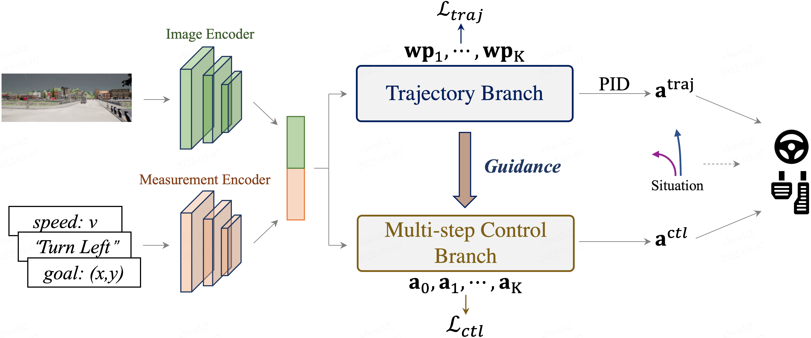

# TCP - Trajectory-guided Control Prediction for End-to-end Autonomous Driving: A Simple yet Strong Baseline



> Trajectory-guided Control Prediction for End-to-end Autonomous Driving: A Simple yet Strong Baseline  
> Penghao Wu, Xiaosong Jia*, Li Chen*, Junchi Yan, Hongyang Li, Yu Qiao    
> [arXiv]()

TODO: badger from paperwithcode

This repository contains the code for the paper [Trajectory-guided Control Prediction for End-to-end Autonomous Driving: A Simple yet Strong Baseline](). **We will release the code and dataset around Sept.**


TCP is a simple unified framework to combine trajectory and control prediction for end-to-end autonomous driving.  By time of release in June 17 2022, our method achieves new state-of-the-art on [CARLA AD Leaderboard](https://leaderboard.carla.org/leaderboard/), in which we rank the **first** in terms of the Driving Score and Infraction Penalty using only a single camera as input. 

## Citation

If you find our repo or our paper useful, please use the following citation:

```
TODO
```

## License
All code within this repository is under [Apache License 2.0](https://www.apache.org/licenses/LICENSE-2.0).
