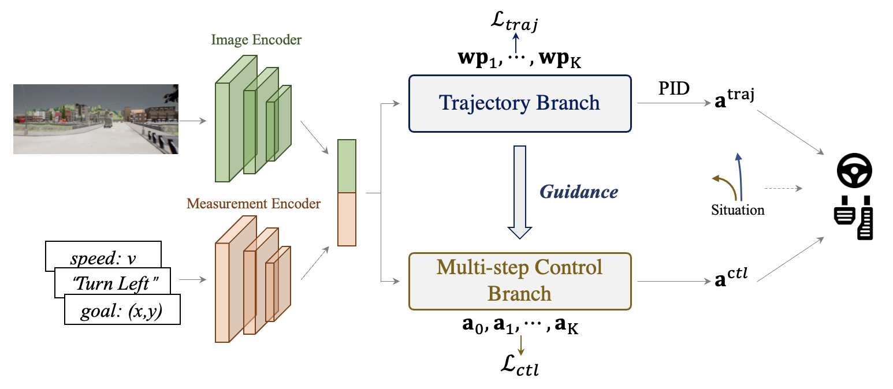

# TCP - Trajectory-guided Control Prediction for End-to-end Autonomous Driving: A Simple yet Strong Baseline



> Trajectory-guided Control Prediction for End-to-end Autonomous Driving: A Simple yet Strong Baseline  
> Penghao Wu*, [Xiaosong Jia*](https://jiaxiaosong1002.github.io/), Li Chen*, [Junchi Yan](https://thinklab.sjtu.edu.cn/), [Hongyang Li](https://lihongyang.info/), [Yu Qiao](http://mmlab.siat.ac.cn/yuqiao/)    
>  - [arXiv Paper](https://arxiv.org/abs/2206.08129)
>  - [Blog in Chinese](https://zhuanlan.zhihu.com/p/532665469)

	
[](https://paperswithcode.com/sota/autonomous-driving-on-carla-leaderboard?p=trajectory-guided-control-prediction-for-end)

This repository contains the code for the paper [Trajectory-guided Control Prediction for End-to-end Autonomous Driving: A Simple yet Strong Baseline](https://arxiv.org/abs/2206.08129). **We will release the code and dataset around Sept.**


TCP is a simple unified framework to combine trajectory and control prediction for end-to-end autonomous driving.  By time of release in June 17 2022, our method achieves new state-of-the-art on [CARLA AD Leaderboard](https://leaderboard.carla.org/leaderboard/), in which we rank the **first** in terms of the Driving Score and Infraction Penalty using only a single camera as input. 

## Citation

If you find our repo or our paper useful, please use the following citation:

```
@article{wu2022trajectoryguided,
 title={Trajectory-guided Control Prediction for End-to-end Autonomous Driving: A Simple yet Strong Baseline}, 
 author={Penghao Wu and Xiaosong Jia and Li Chen and Junchi Yan and Hongyang Li and Yu Qiao},
 journal={arXiv preprint arXiv:2206.08129},
 year={2022},
}
```

## License
All code within this repository is under [Apache License 2.0](https://www.apache.org/licenses/LICENSE-2.0).
